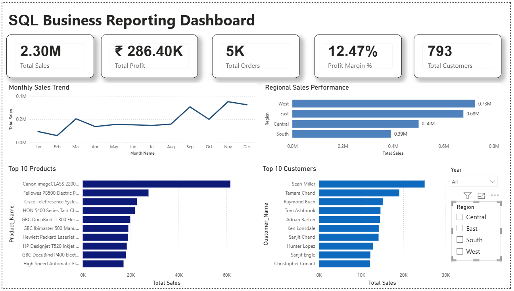

# SQL Business Reporting System

An end-to-end business reporting solution built using **MySQL** and **Power BI**. The project simulates a real-world reporting workflow by importing raw sales data, transforming it into a reporting-ready format, performing business analysis using SQL, and visualizing key insights through an interactive Power BI dashboard.

---

## Overview

This project demonstrates how transactional sales data can be transformed into meaningful business insights using SQL. It follows a structured ETL (Extract, Transform, Load) workflow and includes advanced SQL concepts such as Common Table Expressions (CTEs), Window Functions, Views, Stored Procedures, and Indexes.

The final reporting layer is connected to Power BI to create an executive dashboard for business users.

---

## Project Architecture

```text
Sample - Superstore.csv
          │
          ▼
sales_staging (Raw Data)
          │
          ▼
ETL Transformation
(Date Conversion & Cleaning)
          │
          ▼
sales_reporting
          │
    ┌─────┴─────┐
    │           │
    ▼           ▼
 SQL Views   Stored Procedures
    │           │
    └─────┬─────┘
          ▼
Power BI Dashboard
```

---

## Tech Stack

- MySQL 8.0
- MySQL Workbench
- SQL
- Power BI Desktop
- DAX
- Sample Superstore Dataset

---

## Project Structure

```text
SQL Business Reporting System/
│
├── Dataset/
│   └── Sample - Superstore.csv
│
├── SQL Scripts/
│   ├── 01_Database_Setup.sql
│   ├── 02_Data_Import.sql
│   ├── 03_Data_Transformation.sql
│   ├── 04_Business_KPI_Reports.sql
│   ├── 05_Customer_Product_Analytics.sql
│   ├── 06_Advanced_SQL.sql
│   └── 07_Database_Objects.sql
│
├── Power BI/
│   └── SQL Business Reporting Dashboard.pbix
│
├── Screenshots/
│
└── README.md
```

---

## Key Features

- Imported and transformed transactional sales data using MySQL
- Designed a staging-to-reporting ETL workflow
- Generated executive KPI reports
- Performed customer, product, regional, and shipping analysis
- Built reusable SQL Views and Stored Procedures
- Applied Window Functions, CTEs, and Ranking Functions
- Improved query performance using Indexes
- Connected Power BI directly to the MySQL reporting database

---

## SQL Concepts Demonstrated

### Database Design

- CREATE DATABASE
- CREATE TABLE
- CREATE VIEW
- Stored Procedures
- Indexes

### SQL Reporting

- GROUP BY
- ORDER BY
- Aggregate Functions
- CASE Statements
- Date Functions
- Business KPI Reporting

### Advanced SQL

- Common Table Expressions (CTEs)
- Window Functions
- RANK()
- DENSE_RANK()
- ROW_NUMBER()
- PARTITION BY
- Running Totals
- STR_TO_DATE()
- DATEDIFF()

---

## Dashboard

The Power BI dashboard is connected to the **sales_reporting** table in MySQL and provides:

- Executive KPIs
- Monthly Sales Trend
- Regional Performance
- Top Customers
- Top Products
- Interactive Year and Region Filters


## Dashboard Preview



---

## Business Questions Answered

- What are the overall sales and profit?
- Which regions generate the highest revenue?
- Which products contribute the most sales?
- Who are the top-performing customers?
- How do discounts impact profitability?
- Which shipping methods are used most frequently?
- What are the monthly sales trends?

---

## How to Run

1. Clone the repository.
2. Execute the SQL scripts in numerical order.
3. Update the CSV file path in `02_Data_Import.sql` if required.
4. Open the Power BI report.
5. Connect Power BI to your local MySQL database.
6. Refresh the report to load the latest data.

---

## Learning Outcomes

This project demonstrates practical experience in:

- SQL Database Design
- ETL Processes
- Business Reporting
- Data Analysis
- Query Optimization
- Power BI Integration
- Dashboard Development

---

## Author

**Deepak Kumar**

Computer Engineering Graduate

